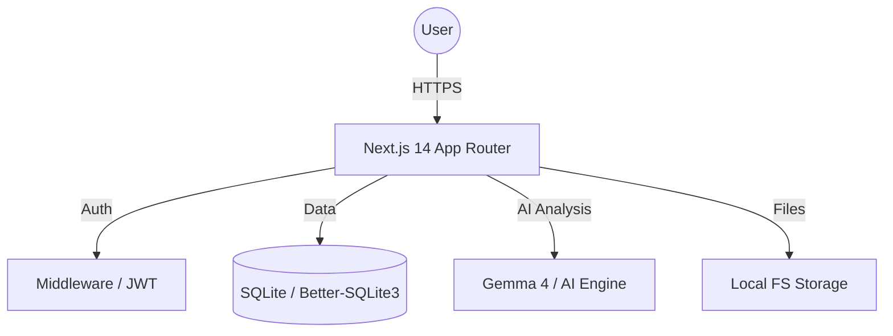

# 🎮 Mayhem-Sequence

**Mayhem-Sequence** is an elite game development operations (GameOps) platform designed to bridge the gap between player feedback, quality assurance, and release management. Built for high-performance studios, it provides automated regression checking, AI-powered sentiment clustering, and release readiness reporting.

---

## 🚀 Quick Start

### Prerequisites
- Node.js 18+
- SQLite3 (Included)
- Ollama (Optional, for local AI features)

### Installation
```bash
# Install dependencies
npm install

# Seed the database (creates admin@mayhem.com / password123)
npm run seed

# Run the development server
npm run dev
```

### Credentials
Refer to [CRED.md](./CRED.md) for initial login details.

---

## ✨ Core Features

- **🤖 AI Feedback Clustering**: Automatically groups player feedback into actionable developer insights using LLMs.
- **🛡️ Automated Regression Check**: Compares new issues against previously resolved ones to flag regressions instantly.
- **📋 Release Readiness Reports**: Generates AI-scored reports on build stability, sentiment trends, and blocker status.
- **📊 Analytics Dashboard**: High-fidelity visualization of feedback volume, sentiment trends, and resolution rates.
- **🏆 Tester Leaderboard**: Gamified QA tracking to reward the most impactful contributors.
- **🔗 Feedback Tokens**: Secure, build-specific links for Discord, Reddit, and private beta communities.

---

## 🏗️ Architecture at a Glance



---

## 📚 Documentation

Detailed documentation is available in the [/documentation](./documentation) folder:

- [**System Architecture & Flows**](./documentation/SYSTEM.md): Deep dive into the internal working of Mayhem-Sequence.
- [**Testing Guide**](./documentation/TESTING.md): Instructions for verifying platform stability and features.
- [**API Reference**](./documentation/API.md): (Planned) Technical endpoint documentation.

---

## 🛡️ License
MIT License - Developed for Modern Game Studios.
