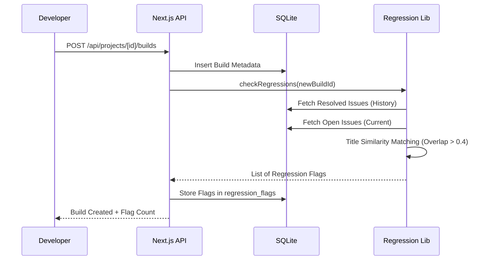
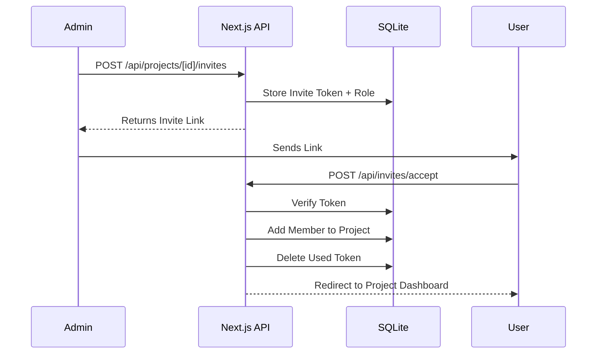

# ⚙️ System Architecture & Working

Mayhem-Sequence is a robust, server-side rendered application built on the **Next.js 14 App Router** architecture. It leverages a centralized **SQLite** database for persistence and integrates with **LLMs** for intelligent data processing.

---

## 🏗️ Architecture Overview

The system follows a modular architecture where frontend pages interact with a secure API layer, which in turn orchestrates logic across database, storage, and AI services.

### Technical Stack
- **Framework**: Next.js 14 (React, TypeScript)
- **Database**: Better-SQLite3
- **Styling**: Tailwind CSS
- **AI Engine**: Gemma 4 (via local/remote endpoint)
- **Auth**: JWT based via secure HTTP-only cookies

---

## 🔄 System Flows

### 1. Build Lifecycle & Regression Check
When a new build is uploaded, the system automatically triggers a regression check to ensure that resolved bugs haven't reappeared.



### 2. Feedback Ingestion & AI Clustering
Feedback is ingested via unique community tokens. Once a threshold is met, AI clusters the feedback into "Suggested Issues".

### 3. Project Invitation Flow
Admins can invite new members to a project via secure tokens.



---

## 🛠️ Feature Deep-Dive

### 🛡️ Regression Engine (`src/lib/regressionCheck.ts`)
The engine uses a **Word Overlap Algorithm** to identify potential regressions:
- Splits titles into word sets.
- Calculates `intersection / max_length`.
- Scores > 0.4 are flagged as potential regressions.
- Allows Admins to "Dismiss" or "Confirm" flags.

### 🤖 AI Insight Engine (`src/lib/ai.ts`)
Integrates with Gemma models to:
- **Summarize Notes**: Expands rough dev notes into structured documentation.
- **Cluster Feedback**: Identifies common themes in raw player feedback.
- **Readiness Scoring**: Calculates a confidence score based on priority weighted issues and sentiment ratios.

### 📊 Analytics Engine (`src/app/api/projects/[id]/analytics`)
Performs real-time SQL aggregations:
- **Sentiment Trend**: Daily avg rating over time.
- **Issue Resolution**: Count of `resolved` vs `open` per build.
- **Volume Heatmap**: Feedback density per category (Physics, UI, Core, etc).

---

## 🔐 User Roles & Permissions

| Role | Access Level | Responsibilities |
| :--- | :--- | :--- |
| **Admin** | Full | Project config, user management, release promotion. |
| **Developer** | Write | Upload builds, resolve issues, expand AI notes. |
| **Tester** | Read/Write | Submit issues, view regression flags. |
| **Player** | Submit Only | Submit feedback via tokens. No dashboard access. |

---

## 📂 Project Structure

```text
src/
├── app/            # Next.js App Router (Routes & Pages)
│   ├── (app)/      # Main dashboard routes
│   ├── (auth)/     # Login/Signup logic
│   └── api/        # REST Endpoints
├── components/     # UI Component library (Pills, Modals, Charts)
├── lib/            # Core System Logic
│   ├── db.ts       # Database Schema & Init
│   ├── ai.ts       # AI Integration
│   └── regressionCheck.ts # Regression Algorithm
└── middleware.ts   # Auth & Role verification
```
